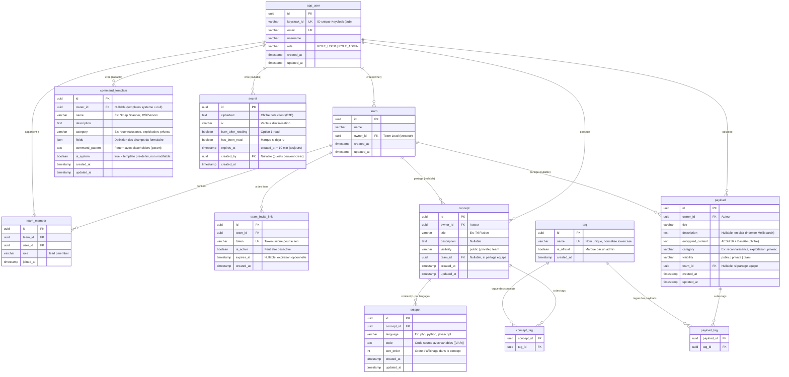

# DevSecVault — Schema Base de Donnees (PostgreSQL)

## Notes sur les choix de modelisation

### UUIDs partout
Tous les IDs sont des UUID v4. Evite les IDs sequentiels previsibles (securite) et facilite la generation cote client pour le Secure Bridge.

### Visibility (public | private | team)
- `public` : visible par tous (guests inclus), indexe dans Meilisearch
- `private` : visible uniquement par le owner
- `team` : visible par les membres de l'equipe referencee dans `team_id`

### Partage equipe = soft relation
Le champ `team_id` + `visibility = team` sur Concept/Payload represente le partage. Pour "unshare", le Team Lead remet `visibility = private` et `team_id = null`. Le contenu n'est jamais supprime.

### Secure Bridge
- `expires_at` est TOUJOURS `created_at + 10 min`
- `burn_after_reading` + `has_been_read` gerent l'option "1 read"
- `created_by` est nullable car les guests (non connectes) peuvent creer des secrets
- Un CRON ou un trigger Symfony nettoie les secrets expires

### Command Templates
- `is_system = true` : templates pre-definis (Nmap, MSFVenom, Gobuster, etc.) non modifiables
- `is_system = false` : templates custom crees par un user
- `fields` est un JSON qui decrit le formulaire (nom, label, placeholder, type)
- `command_pattern` contient le pattern avec des placeholders : `nmap -p{port} -sC -sV -T{timing} {rhost}`

### Tags
- Table de jointure classique (ManyToMany) pour concepts et payloads
- `name` est unique et normalise en lowercase
- La fusion de tags (admin) = UPDATE des FK dans concept_tag/payload_tag puis DELETE du tag source
